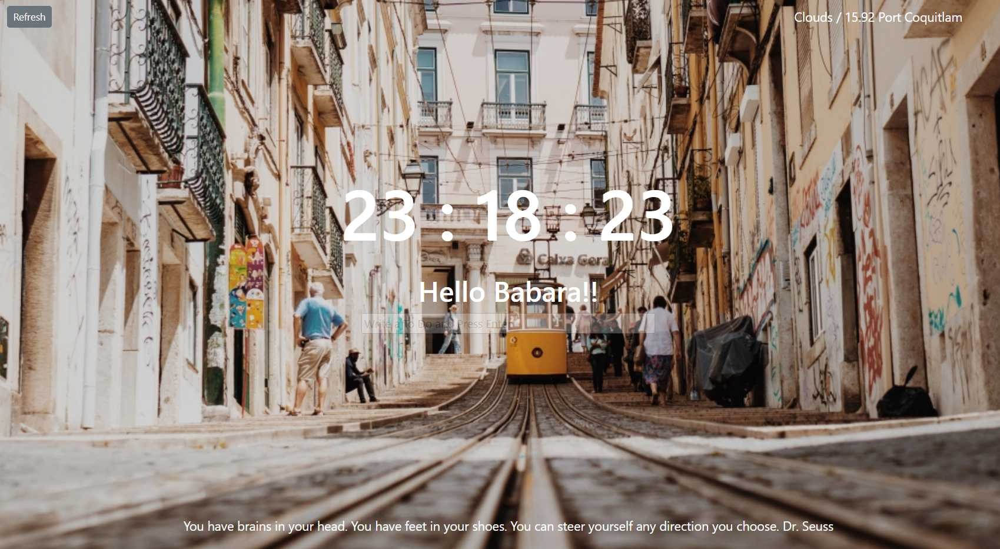

## momentum-js
Implemented the Chrome Extension Momentum in JavaScript

## Sample image

## Languages 

Html, Javascript, CSS

## Description
> Greeting Message

 User info is stored in the localstorage.

 The Greeting message is shown if user info exists in the localstorage.

 Otherwise, the log-in form is shown.

> Clock

Date and time is represented with the Date object.

The timer has been implemented by setInterval and getClock function to keep 1-sec interval.

> Weather

*OpenWeatherMap* API has been hooked up to represent real-time location, weather and temperature info.

> To-do List

The value users submit is placed in the array collection with key-value pairs in the localstorage.

The to-do info is shown from the localstorage.

> Image

The image is selected randomly by the random() function in the Math library from an image array stored

> Quotes

The quote is selected randomly by the random() function in the Math library from an image array stored

## Links(Git-hub page)

click [momentum-js](https://min8grace.github.io/momentum-js/).

